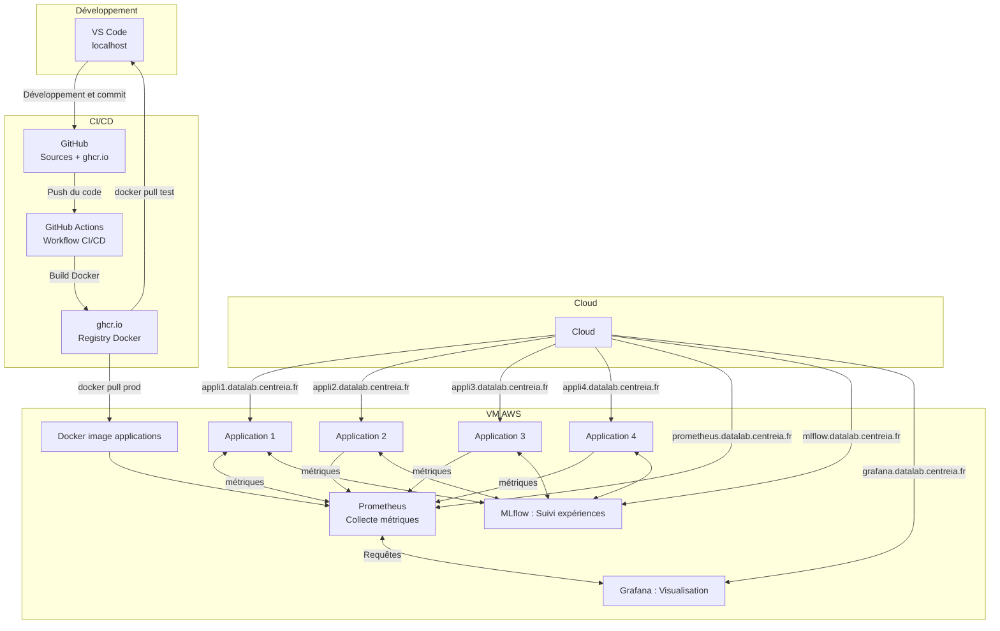

# goudot-immo
démo projet Immobilier

# Semaine 11 - Développer un agent IA immobilier

G1 Cyril, Jonathan, Steve
G2 Arnaud, Fabien
G3 Maximilien, Melody
G4 Patricia, Promise

HugginFace, model meta-llama/Meta-Llama-3-8B-Instruct

## install langchain
```bash
 python3.13 -m venv venv
 source venv/bin/activate
 pip install langchain langchain_huggingface langchain_deepseek langgraph-checkpoint-postgres python-dotenv
 pip install flake8 black
```

## run test
```bash
 python runIA.py
```

//----------------------------------------------------------------------------------------------


G1 : Promise, Patricia
G2 : Dylan, Jonathan, Steve
G3 : Cyril, Melody, Maximilien
G4 : Arnaud, Fabien

# Instalation
```bash
 python3.13 -m venv venv
 source venv/bin/activate
 pip install pip-tools ansible
 pip-compile
 pip install -r requirements.txt
```

# Appli Web
```bash
 source venv/bin/activate
 MLFLOW_URI="https://mlflow.datalab.centreia.fr/" fastapi run app/main.py #dev main.py
```

# CI/CD
Le workflow (.github/workflows/docker-build-push.yml) va créer l'image docker à partir du commit dans main  
Cette image va être poussée dans le registry ghcr.io  
On peut alors la récupérer & l'executer avec :
> docker pull ghcr.io/data-ia-2024/goudot-immo:main
Il faut s'autentifier au registry avec :
> docker login ghcr.io
user de github et token (read:packages) 

Pour l'exécuter : 
> docker run -p 5010:8000 -d ghcr.io/data-ia-2024/goudot-immo:main


> docker run -d --name prometheus -p 9090:9090 -v /home/ubuntu/prometheus.yml:/etc/prometheus/prometheus.yml prom/prometheus

> docker run -d --name grafana --network p4_network -p 3000:3000 grafana/grafana

# VM
créer instance
ssh -L5000:localhost:5000 ubuntu@ec2-18-133-252-5.eu-west-2.compute.amazonaws.com
```bash
=> utiliser ~/.ssh/p4greta.pem

sudo passwd ubuntu # définir PWD
sudo nano /etc/ssh/sshd_config
Ajout:
PasswordAuthentication yes
ChallengeResponseAuthentication yes
#UsePAM yes
PubkeyAuthentication yes  # (Laisse activé si tu veux aussi garder les clés SSH)

sudo systemctl restart ssh
# redirection port...
ssh -fN -L5000:localhost:5001 p4g3@datalab.myconnectech.fr

sudo apt update
sudo apt install -y docker.io
sudo usermod -aG docker $USER
curl https://raw.githubusercontent.com/jesseduffield/lazydocker/master/scripts/install_update_linux.sh | bash

```

# Deploiement
```bash
 ansible-playbook -i inventory.ini playbook.yaml
```


